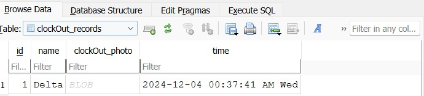

<div align="center">
  <h1 align = "center">Huizhou Grocery Clock-in and Clock-out System </h1>
</div>

[](/LICENSE)

We just built a simple clock-in and clock-out system for our grocery. And we are testing many functions based on many actual situations.

Let us explore this simple system, and we will talk about tech stacks.

Firstly, we still use tkinter as our desktop platform, which has less code to realize functions. Second, we will use the default camera of laptop(many desktops need to set up an extra camera) to realize the core function of the clock-in and clock-out system. 

We need to run these commands on our terminal.

```
pip install opencv-python
```

```
pip install ttkbootstrap
```
<br>

<p align="center">
  
</p>

This time we put all code into one Class and let our code become more concise and reduce  lines of code. We just focus on function name and self. It is easier to read all functions..

Let us run our laptop app, and we could change it to a dark theme.

<p align="center">
  
</p>

<p align="center">
  
</p>

<p align="center">
  
</p>

<p align="center">
  
</p>

As an employer or manager, you need to register all employees' information first. We have created this function first, and the default password is 12345. You need to upload employee ID, name, or other things into the database. 


<p align="center">
  
</p>

Now it is working time now, and employee Beta could clock in, and the camera will start to work. It will get a self-portrait image immediately and will be sent to the database. The OpenCV library will help us do this. It still has the start break or begin work function.

<p align="center">
  
</p>

<p align="center">
  
</p>

<p align="center">
  
</p>

<p align="center">
  
</p>

We do not explain more about laptop app functions; we just pasted some screenshots in there.
